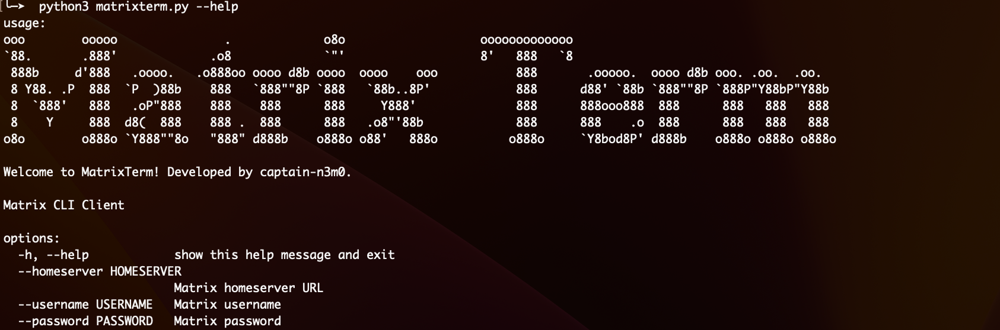

# MatrixTerm CLI Client

MatrixTerm is a command-line interface (CLI) client for Matrix, a decentralized communication protocol. This Python-based CLI client allows you to interact with Matrix chat rooms, join rooms, send messages, and more.



## Features

- **List Joined Rooms:** View a list of rooms you have joined.
- **Join a Matrix Room:** Easily join Matrix rooms using room IDs.
- **Send Messages:** Send text messages to any room you are part of.
- **Interactive CLI:** Enjoy a clean and interactive command-line interface for seamless navigation.
- **Asynchronous Operation:** Built on `asyncio` for responsive and efficient performance.
- **Configuration File Support:** Save your Matrix server and login credentials for quick access.
- **Room Management:** Leave rooms and manage your room list effectively.
- **Message History Retrieval:** Fetch and view message history within any room.

## Installation

1. Clone this repository:
   ```bash
   git clone https://github.com/captain-n3m0/MatrixTerm.git
   cd MatrixTerm

2. Install the required dependencies:
   ```bash
   pip install -r requirements.txt
   ```
3. Usage:
   ```bash
   python matrixterm.py --homeserver MATRIX_HOMESERVER_URL --username YOUR_USERNAME --password YOUR_PASSWORD

   ```
LICENSE: This project is licensed under the terms of the MIT license.

4. Contributing
   Pull requests are welcome. For major changes, please open an issue first to discuss what you would like to change.


